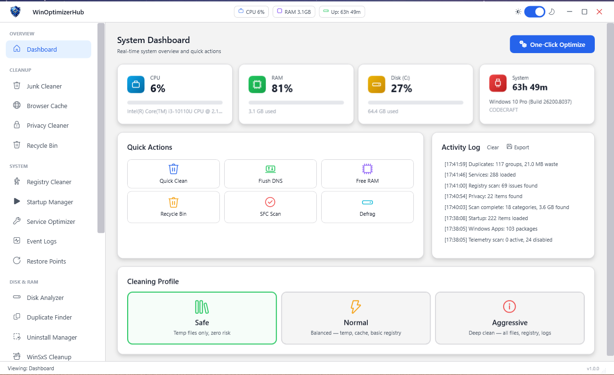
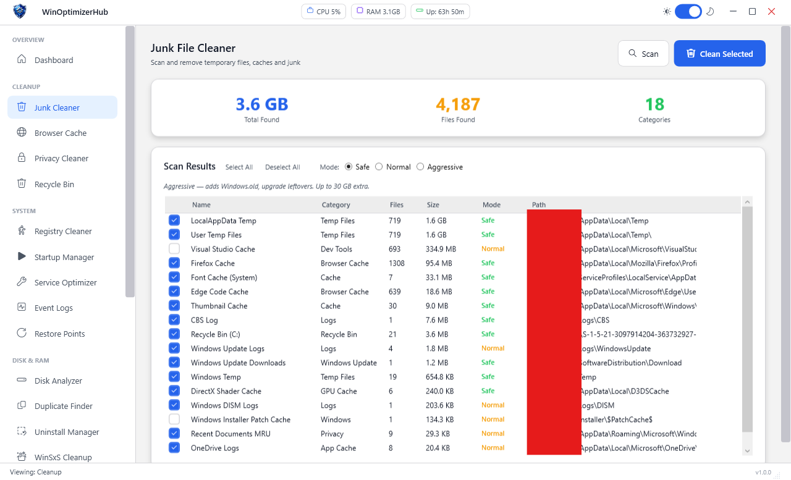
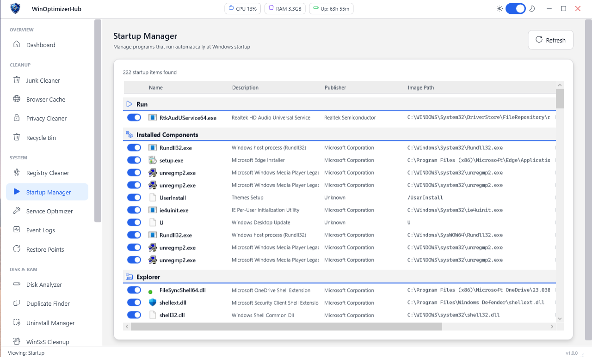
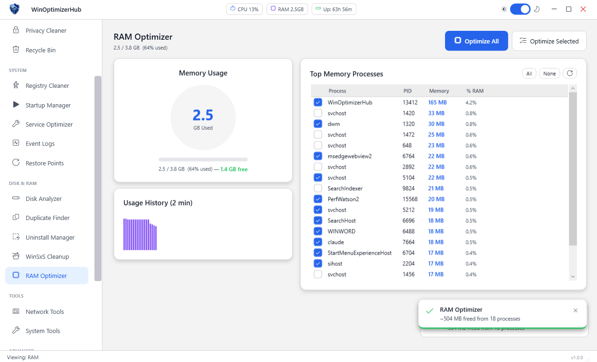

# WinOptimizerHub

> A modern, open-source Windows system optimization suite built with **WPF** and **C# 9.0** on **.NET 4.8.1**.


---

## Overview

WinOptimizerHub is a comprehensive Windows optimization tool that consolidates 20+ system maintenance modules into a single, polished interface. It features a fully custom dark/light theme engine, MVVM architecture, async operations to keep the UI responsive, and persistent user settings across sessions.

---

## Features

### 🧹 Cleaning
| Module | Description |
|--------|-------------|
| **Junk Cleaner** | Removes temp files, Windows Update cache, thumbnail cache, log files, and more |
| **Browser Cache Cleaner** | Clears cache and cookies for Chrome, Firefox, Edge, and Opera |
| **Recycle Bin Cleaner** | Empties and reports Recycle Bin size per drive |
| **Privacy Cleaner** | Wipes MRU lists, recent documents, clipboard history |
| **Event Log Cleaner** | Clears Windows Event Logs by category |
| **Font Cache Cleaner** | Rebuilds the Windows font cache to fix rendering issues |
| **Windows Update Cleanup** | Removes superseded Windows Update files via WinSxS cleanup |

### 🔧 Optimization
| Module | Description |
|--------|-------------|
| **Registry Cleaner** | Scans and removes orphaned keys, invalid paths, broken COM entries |
| **Startup Manager** | Manages startup entries from Registry, Scheduled Tasks, and Startup folders |
| **RAM Optimizer** | Real-time memory graph, force-free working sets, process memory monitor |
| **SSD Tweaker** | Applies TRIM, disables prefetch/superfetch, adjusts indexing and hibernation |
| **Network Optimizer** | TCP/IP tweaks, DNS cache flush, adapter diagnostics and reset |
| **Power Settings** | Quick-apply power plans optimized for performance or efficiency |

### 🔍 Analysis
| Module | Description |
|--------|-------------|
| **Disk Analyzer** | Visualizes folder sizes, finds space hogs, drill-down navigation |
| **Duplicate Finder** | Byte-accurate duplicate file detection across any directory tree |
| **WinSxS Analyzer** | Reports WinSxS folder size with cleanup recommendations |

### 🛡️ Management
| Module | Description |
|--------|-------------|
| **Services Manager** | Enable/disable/restart Windows services with safety-aware defaults |
| **Task Scheduler** | View, enable, disable, and delete scheduled tasks |
| **Uninstall Manager** | Faster, cleaner app uninstaller with forced-removal support |
| **Telemetry Disabler** | Blocks Windows data collection tasks and telemetry services |
| **System Restore** | Create, restore, and delete system restore points |
| **System Tools** | Quick-launch shortcuts to built-in Windows tools |

### 📊 Dashboard
- Unified system health score
- Cleaning history chart with per-session stats
- Toast notification system for background operation feedback

---

## Screenshots

| Dashboard | Junk Cleaner |
|-----------|-------------|
|  |  |

| Startup Manager | RAM Optimizer |
|----------------|---------------|
|  |  |

---

## Architecture

```
WinOptimizerHub/
├── Views/                  # 20+ XAML views, one per module
├── ViewModels/             # MVVM ViewModels with AsyncRelayCommand
├── Services/               # Business logic — one service per feature
├── Models/                 # Data models and ObservableObject base
├── Helpers/                # AppLogger, FormatHelper, DialogService, UserSettings
├── Converters/             # WPF value converters (BoolToVisibility, etc.)
├── Themes/                 # DarkTheme.xaml / LightTheme.xaml
└── MainWindow.xaml         # Shell with navigation, toast overlay, theme toggle
```

**Key design decisions:**

- **MVVM** — strict separation between UI (Views) and logic (ViewModels + Services)
- **AsyncRelayCommand** — all long-running operations run on background threads; the UI never freezes
- **ResourceDictionary theming** — Dark/Light themes switch at runtime without restarting
- **UserSettings** — window state, last active panel, and theme preference are persisted between sessions
- **AppLogger** — centralized exception logging with export-to-file support

---

## Requirements

- **OS:** Windows 10 or Windows 11 (64-bit)
- **.NET:** [.NET Framework 4.8.1](https://dotnet.microsoft.com/en-us/download/dotnet-framework/net481)
- **Privileges:** Must be run as **Administrator** (required for Registry, Services, Telemetry modules)
- **Disk:** ~200 MB

---

## Building from Source

```bash
# 1. Clone the repository
git clone https://github.com/CodexN0sf3/WinOptimizerHub.git
cd WinOptimizerHub

# 2. Open WinOptimizerHub.sln in Visual Studio 2022

# 3. Select configuration: Release | x64

# 4. Build → Build Solution  (Ctrl+Shift+B)

# 5. Run as Administrator
#    Right-click WinOptimizerHub.exe → Run as administrator
```

**Dependencies:** All references are standard .NET Framework assemblies — no NuGet packages required.

---

## Usage Notes

> ⚠️ **Always create a System Restore Point before using cleaning or registry modules.**
> WinOptimizerHub includes a one-click Restore Point creator in the System Restore module.

- The **Registry Cleaner** and **SSD Tweaker** modules make system-level changes. Review items before applying.
- The **Telemetry Disabler** modifies Windows scheduled tasks and registry keys. Changes can be undone from the same module.
- The **Services Manager** color-codes services by recommended state to help avoid disabling critical components.

---

## Contributing

Contributions are welcome! Here's how to get started:

1. **Fork** this repository
2. Create a feature branch: `git checkout -b feature/my-new-module`
3. Commit your changes: `git commit -m "Add: MyNewModule service and view"`
4. Push and open a **Pull Request**

Please follow the existing MVVM structure — one Service, one ViewModel, one View per feature.

### Ideas for contributions
- macOS / Linux compatibility layer (long shot, but why not)
- Additional browser support (Brave, Vivaldi)
- Localization / i18n support
- Unit tests for Service classes
- GitHub Actions CI pipeline

---

## License

This project is licensed under the **MIT License** — see [LICENSE](LICENSE) for details.

---

## Acknowledgements

Built with standard .NET Framework libraries:
`System.Management` · `Microsoft.Win32.Registry` · `System.ServiceProcess` · `System.Windows.Forms` · `PresentationFramework (WPF)`

---

*Made with ❤ in C# — feedback and stars are appreciated!*
